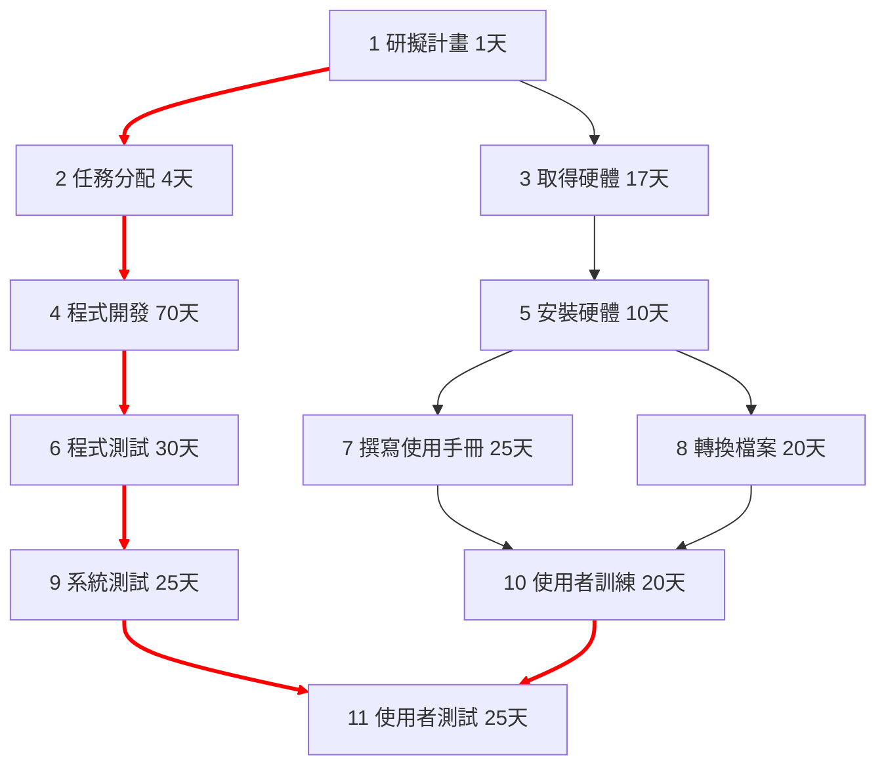
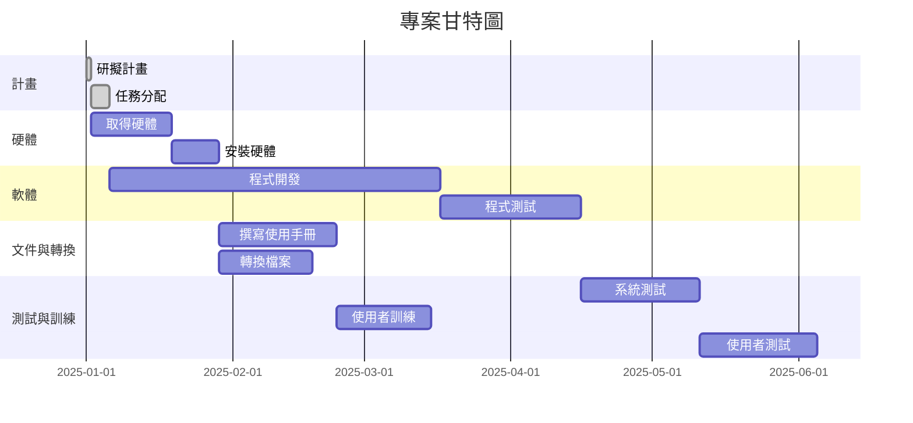

## (1) PERT/CPM 圖

```mermaid
flowchart TD
    A[1 研擬計畫 1天] --> B[2 任務分配 4天]
    A --> C[3 取得硬體 17天]
    B --> D[4 程式開發 70天]
    C --> E[5 安裝硬體 10天]
    D --> F[6 程式測試 30天]
    E --> G[7 撰寫使用手冊 25天]
    E --> H[8 轉換檔案 20天]
    F --> I[9 系統測試 25天]
    G --> J[10 使用者訓練 20天]
    H --> J
    I --> K[11 使用者測試 25天]
    J --> K

    %% 標示關鍵路徑（紅色粗線）
    linkStyle 0 stroke:red,stroke-width:3px
    linkStyle 2 stroke:red,stroke-width:3px
    linkStyle 4 stroke:red,stroke-width:3px
    linkStyle 7 stroke:red,stroke-width:3px
    linkStyle 10 stroke:red,stroke-width:3px
    linkStyle 11 stroke:red,stroke-width:3px

```

---

## (2) 甘特圖

```mermaid
gantt
    title 專案甘特圖
    dateFormat  YYYY-MM-DD
    section 計畫
    研擬計畫        :done, a1, 2025-01-01, 1d
    任務分配        :done, a2, after a1, 4d
    
    section 硬體
    取得硬體        :a3, after a1, 17d
    安裝硬體        :a5, after a3, 10d
    
    section 軟體
    程式開發        :a4, after a2, 70d
    程式測試        :a6, after a4, 30d
    
    section 文件與轉換
    撰寫使用手冊    :a7, after a5, 25d
    轉換檔案        :a8, after a5, 20d
    
    section 測試與訓練
    系統測試        :a9, after a5 a6, 25d
    使用者訓練      :a10, after a7 a8, 20d
    使用者測試      :a11, after a9 a10, 25d

```
## (3) 關鍵路徑（Critical Path）：** 1 → 2 → 4 → 6 → 9 → 11（總工期 155 天）
