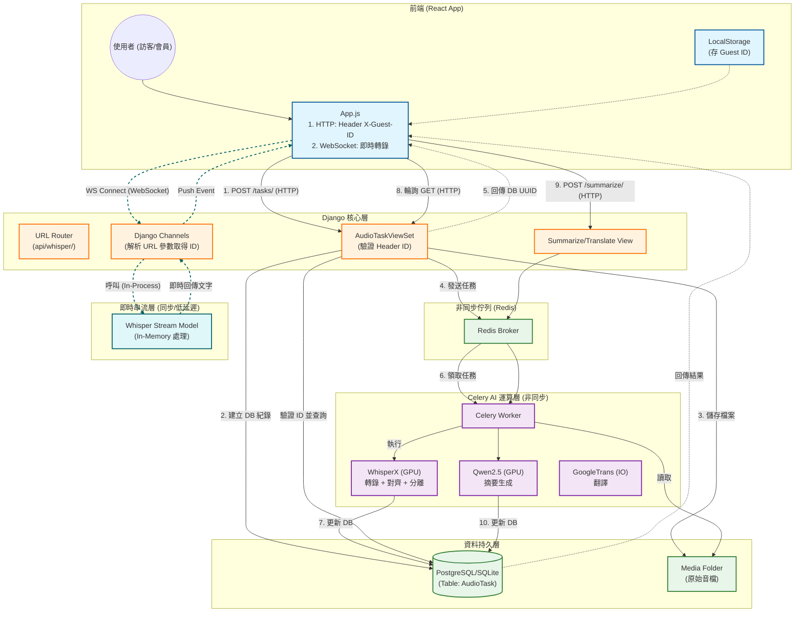
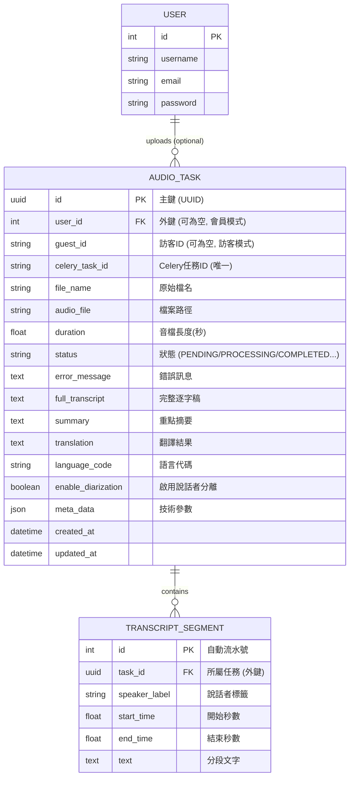

```mermaid
graph TD
    %% 定義樣式
    classDef client fill:#e1f5fe,stroke:#01579b,stroke-width:2px;
    classDef server fill:#fff3e0,stroke:#ff6f00,stroke-width:2px;
    classDef ai fill:#f3e5f5,stroke:#7b1fa2,stroke-width:2px;
    classDef data fill:#e8f5e9,stroke:#2e7d32,stroke-width:2px;
    classDef stream fill:#e0f7fa,stroke:#006064,stroke-width:2px; 

    subgraph Client_Side ["前端 (React App)"]
        User(("使用者 (訪客/會員)"))
        BrowserStorage["LocalStorage<br/>(存 Guest ID)"]:::client
        %% 修正點：修正拼字 Webstock -> WebSocket
        App["App.js<br/>1. HTTP: Header X-Guest-ID<br/>2. WebSocket: 即時轉錄"]:::client
    end

    subgraph Backend_Server ["Django 核心層"]
        Router["URL Router<br/>(api/whisper/)"]:::server
        ViewSet["AudioTaskViewSet<br/>(驗證 Header ID)"]:::server
        APIView["Summarize/Translate View"]:::server
        Channels["Django Channels<br/>(解析 URL 參數取得 ID)"]:::server
    end

    subgraph Async_Queue ["非同步佇列 (Redis)"]
        Redis["Redis Broker"]:::data
    end

    subgraph AI_Workers ["Celery AI 運算層 (非同步)"]
        Worker["Celery Worker"]:::ai
        WhisperX["WhisperX (GPU)<br/>轉錄 + 對齊 + 分離"]:::ai
        Qwen["Qwen2.5 (GPU)<br/>摘要生成"]:::ai
        GTrans["GoogleTrans (IO)<br/>翻譯"]:::ai
    end

    subgraph Realtime_Engine ["即時串流層 (同步/低延遲)"]
        WhisperStream["Whisper Stream Model<br/>(In-Memory 處理)"]:::stream
    end

    subgraph Storage ["資料持久層"]
        %% 強調只有非同步任務會寫入 DB
        DB[("PostgreSQL/SQLite<br/>(Table: AudioTask)")]:::data
        Media["Media Folder<br/>(原始音檔)"]:::data
    end

    %% --- 流程連線 ---

    %% 1. 初始化
    User --> App
    BrowserStorage -.-> App

    %% 2. 檔案上傳流程 (HTTP - 走 Header)
    App -- "1. POST /tasks/ (HTTP)" --> ViewSet
    ViewSet -- "2. 建立 DB 紀錄" --> DB
    ViewSet -- "3. 儲存檔案" --> Media
    ViewSet -- "4. 發送任務" --> Redis
    ViewSet -. "5. 回傳 DB UUID" .-> App

    %% 3. Celery 處理流程
    Redis -- "6. 領取任務" --> Worker
    Worker -- "讀取" --> Media
    Worker -- "執行" --> WhisperX
    WhisperX -- "7. 更新 DB" --> DB

    %% 4. 前端輪詢
    App -- "8. 輪詢 GET (HTTP)" --> ViewSet
    ViewSet -- "驗證 ID 並查詢" --> DB
    DB -. "回傳結果" .-> App

    %% 5. 摘要/翻譯
    App -- "9. POST /summarize/ (HTTP)" --> APIView
    APIView --> Redis
    Redis --> Worker
    Worker --> Qwen
    Qwen -- "10. 更新 DB" --> DB

    %% 6. 即時轉錄 (WebSocket)
    App -- "WS Connect (WebSocket)" --> Channels
    Channels -- "呼叫 (In-Process)" --> WhisperStream
    WhisperStream -- "即時回傳文字" --> Channels
    Channels -- "Push Event" --> App
    
    %% 特別註記：即時轉錄目前不存 DB (虛線表示)
    linkStyle 19,20,21,22 stroke-width:2px,fill:none,stroke:#006064,stroke-dasharray: 5 5;
```

```mermaid
erDiagram
    %% Django 內建 User 模型 (簡化表示)
    USER {
        int id PK
        string username
        string email
        string password
    }

    %% 主任務表 (AudioTask)
    AUDIO_TASK {
        uuid id PK "主鍵 (UUID)"
        int user_id FK "外鍵 (可為空, 會員模式)"
        string guest_id "訪客ID (可為空, 訪客模式)"
        string celery_task_id "Celery任務ID (唯一)"
        string file_name "原始檔名"
        string audio_file "檔案路徑"
        float duration "音檔長度(秒)"
        string status "狀態 (PENDING/PROCESSING/COMPLETED...)"
        text error_message "錯誤訊息"
        text full_transcript "完整逐字稿"
        text summary "重點摘要"
        text translation "翻譯結果"
        string language_code "語言代碼"
        boolean enable_diarization "啟用說話者分離"
        json meta_data "技術參數"
        datetime created_at
        datetime updated_at
    }

    %% 逐字稿細項表 (TranscriptSegment)
    TRANSCRIPT_SEGMENT {
        int id PK "自動流水號"
        uuid task_id FK "所屬任務 (外鍵)"
        string speaker_label "說話者標籤"
        float start_time "開始秒數"
        float end_time "結束秒數"
        text text "分段文字"
    }

    %% 關聯定義
    %% 一個 User 可以有多個 AudioTask，但 AudioTask 的 User 可以是 Null (0 or more)
    USER ||--o{ AUDIO_TASK : "uploads (optional)"
    
    %% 一個 AudioTask 可以包含多個 TranscriptSegment (0 or more)
    AUDIO_TASK ||--o{ TRANSCRIPT_SEGMENT : "contains"
```
